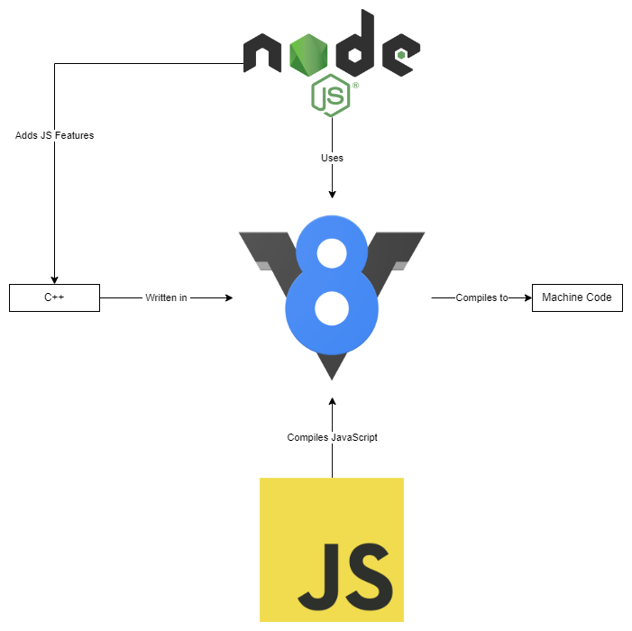
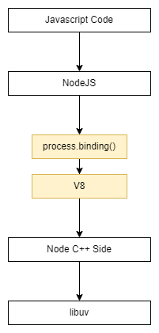
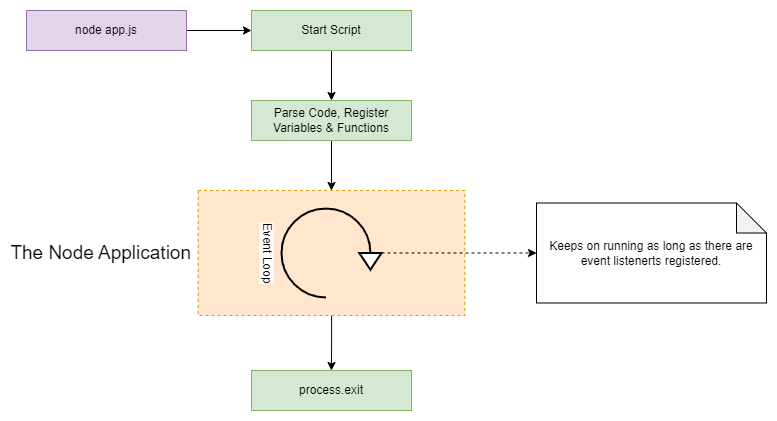
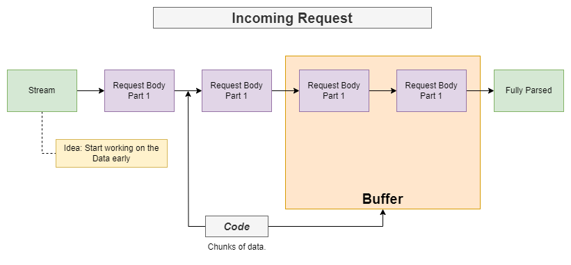
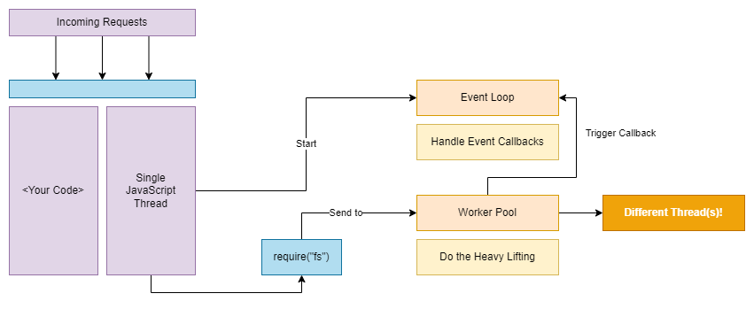
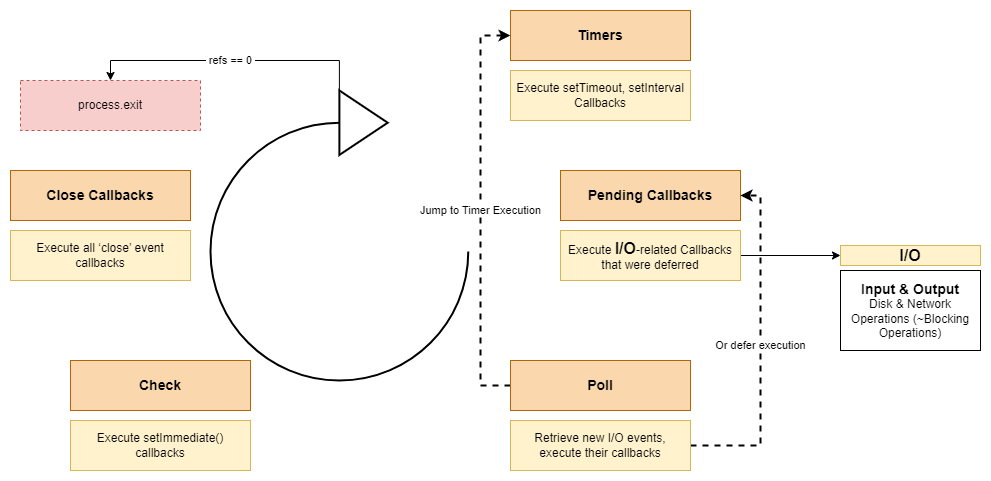
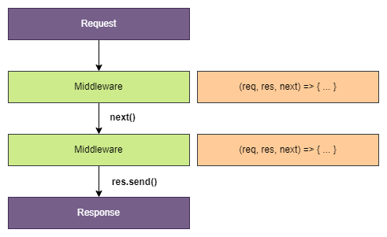
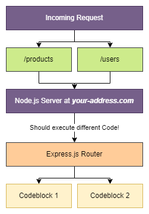
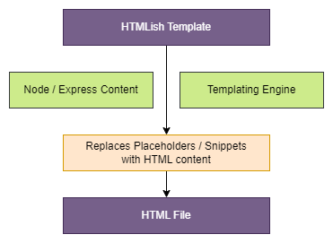

# NodeJS overview and examples <!-- omit in toc -->

## Contents <!-- omit in toc -->

- [1. Node.js](#1-nodejs)
  - [1.1. Introduction](#11-introduction)
  - [1.2. Architecture](#12-architecture)
  - [1.3. Core Modules](#13-core-modules)
  - [1.4. Lifecycle](#14-lifecycle)
  - [1.5. Streams \& Buffers](#15-streams--buffers)
  - [1.6. Single Thread, Event Loop \& Blocking Code](#16-single-thread-event-loop--blocking-code)
  - [1.7. The Event Loop](#17-the-event-loop)
  - [1.8. Asynchronous Code](#18-asynchronous-code)
  - [1.9. REPL vs Using Files](#19-repl-vs-using-files)
    - [1.9.1. Running Node.js Code](#191-running-nodejs-code)
  - [1.10. Global Features vs Core Modules vs Third-Party Modules](#110-global-features-vs-core-modules-vs-third-party-modules)
  - [1.11. CommonJS modules and ES modules syntax](#111-commonjs-modules-and-es-modules-syntax)
- [2. NPM](#2-npm)
  - [2.1. 3rd Party Packages](#21-3rd-party-packages)
- [3. Debugging](#3-debugging)
  - [3.1. Types of Errors](#31-types-of-errors)
  - [3.2. Debugging](#32-debugging)
- [4. Express.js](#4-expressjs)
  - [4.1. What Does Express.js Help You With?](#41-what-does-expressjs-help-you-with)
  - [4.2. Middleware](#42-middleware)
  - [4.3. Routing](#43-routing)
  - [4.4. Serve Files](#44-serve-files)
  - [4.5. Request \& Response Data](#45-request--response-data)
  - [4.6. Alternatives](#46-alternatives)
- [5. Template Engines](#5-template-engines)
  - [5.1. Available Templating Engines](#51-available-templating-engines)
- [6. Sequelize](#6-sequelize)
  - [6.1. Core concepts](#61-core-concepts)
  - [6.2. Summary](#62-summary)
- [7. Mongoose](#7-mongoose)
  - [7.1. Core Concepts](#71-core-concepts)
- [8. Deno](#8-deno)
  - [8.1. Introduction](#81-introduction)
  - [8.2. Deno vs Node.js](#82-deno-vs-nodejs)
- [9. Packages](#9-packages)
- [10. Commands](#10-commands)

# 1. Node.js

## 1.1. Introduction

- What is Node.js?
  - **A JavaScript Runtime.**
  - **"JavaScript on the Server"**
- Node.js is a different version of javascript.
- It allows to run javascript code on the server, in theory not just on the server but on any machine though.
- Node.js to run javascript outside of the browser.
  - Node.js uses V8 and V8 simply is the name of the javascript engine built by Google that runs javascript in the browser.



## 1.2. Architecture



## 1.3. Core Modules

- Node.js ships with multiple core modules (`http`, `fs`, `path`, ...).
- Core modules can be imported into any file to be used there.
- Import via `require("<module_name>")`.
  - `http` - Launch a server, send requests.
  - `https` - Launch a SSL server.
  - `fs` - Work with the file system.
  - `path` - Handle paths elegantly.
  - `os` - Get OS information.

## 1.4. Lifecycle



## 1.5. Streams & Buffers

- Parse request data in chunks (Streams & Buffers).
- Avoid "double responses".



## 1.6. Single Thread, Event Loop & Blocking Code

- Node.js runs non-blocking JS code and uses an event driven code ("Event Loop") for running your logic.
- A Node program exits as soon as there is no more work to do.
- Note: The createServer() event never finishes by default.



## 1.7. The Event Loop



## 1.8. Asynchronous Code

- JS code is non-blocking.
- Use callbacks and events => Order changes!

## 1.9. REPL vs Using Files

- The REPL (Console)
  - `Read` - Read User Input.
  - `Eval` - Evaluate User Input.
  - `Print` - Print Output (Result).
  - `Loop` - Wait for new Input.

### 1.9.1. Running Node.js Code

- **Execute Files**
  - Used for real apps.
  - Predictable sequence of steps.
- **Use the REPL**
  - Great playground!
  - Execute code as you write it.

## 1.10. Global Features vs Core Modules vs Third-Party Modules

- **Global features**
  - Keywords like const or function but also some global objects like process.
  - **Global features** are **always available**, don't need to import them into the files where you want to use them.
- **Core Node.js Modules**
  - Examples would be the file-system module `("fs")`, the path module `("path")` or the Http module `("http")`.
  - **Core Node.js Modules** don't need to be installed (**NO** `npm install` is required) but you **need to import them** when you want to use features exposed by them.
  - Example:
    `const fs = require('fs');`
    - You can now use the fs object exported by the "fs" module.
- **Third-party Modules**
  - **Third-party Modules need to be installed** (via `npm install` in the project folder) AND imported.
  - Example (which you don't need to understand yet - we'll cover this later in the course):
  ```
    // In terminal/ command prompt
    npm install --save express-session
    // In code file (e.g. app.js)
    const sessions = require('express-session');
  ```

## 1.11. CommonJS modules and ES modules syntax

- By default, Node.js treats JavaScript code as **CommonJS modules**.
- Because of this, CommonJS modules are characterized by the `require()` statement for module imports and `module.exports` for module exports.

[Example](Examples/FunctionsOtherFile/)

# 2. NPM

- npmstands for "Node Package Manager" and it allows you to manage your Node project and its dependencies.
- You can initialize a project with `npm init`.
- npmscripts can be defined in the `package.json` to give you "shortcuts" to common tasks/ commands.

## 2.1. 3rd Party Packages

- Node projects typically don't just use core modules and custom code but also third-party packages.
- You install them via npm.
- You can differentiate between production dependencies `(--save)`, development dependencies `(--save-dev)` and global dependencies `(-g)`.

# 3. Debugging

## 3.1. Types of Errors

- **Syntax**, **runtime** and **logical errors** can break your app.
- Syntax and runtime errors throw (helpful) error messages (with line numbers!).
- Logical errors can be fixed with testing and the help of the debugger.

## 3.2. Debugging

- Use the VS Code Node debugger to step into your code and go through it step by step.
- Analyze variable values at runtime.
- Look into (and manipulate) variables at runtime.
- Set breakpoints cleverly (i.e. respect the async/ event-driven nature).

# 4. Express.js

- Express.js is Node.js framework
  - A package that adds a bunch of utility functions and tools and a clear set of rules on how the app should be built (middleware!).
- It's highly extensible and other packages can be plugged into it (middleware!).
- Server Logic is Complex!
- We want to focus on your Business Logic, not on the nitty-gritty Details!
- Use a Framework for the Heavy Lifting!
- **Framework:** Helper functions, tools & rules that help you build your application!

## 4.1. What Does Express.js Help You With?

- Parsing Requests & Sending Responses
  - Extract Data
  - Render HTML Pages
  - Return Data / HTML Responses
- Routing
  - Execute different Code for different Requests
  - Filter / Validate incoming Requests
- Managing Data
  - Manage Data across Requests (Sessions)
  - Work with Files
  - Work with Databases

## 4.2. Middleware

- Express.js relies heavily on middleware functions you can easily add them by calling `use()`.
- Middleware functions handle a request and should call `next()` to forward the request to the next function in line or send a response.



## 4.3. Routing

- You can filter requests by path and method.
- If you filter by method, paths are matched exactly, otherwise, the first segment of a URL is matched.
- You can use the express.Router to split your routes across files elegantely.



## 4.4. Serve Files

- You're not limited to serving dummy text as a response.
- You can `sendFile()` to your users e.g. HTML files.
- If a request is directly made for a file (e.g. a .css file is requested), you can enable static serving for such files via `express.static()`.

## 4.5. Request & Response Data

## 4.6. Alternatives

- Vanilla Node.js
- Adonis.js
- Koa
- Sails.js
- Others

# 5. Template Engines



## 5.1. Available Templating Engines

- **EJS**
  - Use normal HTML and plain JavaScript in your templates
    - `<p><%= name %></p>`
- **Pug (Jade)**
  - Use minimal HTML and custom template language
    - `p #{name}`
- **Handlebars**
  - Use normal HTML and custom template language
    - `<p>{{ name }}</p>`

# 6. Sequelize

- What is Sequelize?
  - An **ORM** = Object-Relational Mapping Library.


## 6.1. Core concepts

- **Models**
  - `e.g. Book, Loan`
- **Instances**
  - `const book = Book.build()`
- **Queries**
  - `Book.findAll()`
- **Associations**
  - `Book.hasMany(Loan)`

## 6.2. Summary

- **SQL**
  - SQL uses strict data schemas and relations.
  - You can connect your Node.js app via packages like `mysql2`.
  - Writing SQL queries is not directly related to Node.js and something you have to learn in addition to Node.js.
- **Sequelize**
  - Instead of writing SQL queries manually, you can use packages (ORMs) like Sequelize to focus on the Node.js code and work with native JS objects.
  - Sequelize allows you define models and interact with the database through them.
  - You can also easily set up relations ("Associations") and interact with your related models through them.

# 7. Mongoose

- What is Mongoose?
  - A **ODM** = Object-Document Mapping Library.


## 7.1. Core Concepts

- **Schemas & Models**
  - `e.g. Book, Loan`
- **Instances**
  - `const book = new Book()`
- **Queries**
  - `User.find()`

# 8. Deno

## 8.1. Introduction

- Node = Deno
- An alternative to Node.
- Deno is a JavaScript Runtime based on Chrome's V8 JavaScript Engine.
  - Allows run JavaScript outside of the browser.
- Deno supports **JavaScript** & **TypeScript**.
- Deno support **URL imports** and **modern JavaScript features** (e.g. Promises).
- Deno is "secure by default" and requires explicit execution permissions.

## 8.2. Deno vs Node.js

| Deno                                                                                                                                        | Node.js                                                                                                                  |
| ------------------------------------------------------------------------------------------------------------------------------------------- | ------------------------------------------------------------------------------------------------------------------------ |
| TypeScript support, modern JS features, URL imports, script permissions.                                                                    | Only JavaScript, modern JS features are missing, custom module system no script permissions.                             |
| Pretty new, small ecosystem, not used in production by major companies yet, smaller base of maintainers, not really used in production yet. | Established, highly active ecosystem, used by thousands of (big) companies, huge base of maintainers, production-proven. |

# 9. Packages

- express.js
  - `npm install --save express`
- express.js validator
  - `npm install --save express-validator`
- nodemon
  - `npm install nodemon -g`
  - `npm install nodemon --save-dev`
- body-parser
  - `npm install --save body-parser`
- mongoose
  - `npm install --save mongoose`
- sequelize
  - `npm install --save sequelize`
- database packages
  - `npm install --save mysql2` # MySql
  - `npm install --save mariadb`
  - `npm install --save sqlite3`
  - `npm install --save tedious` # Microsoft SQL Server
- jsonwebtoken
  - `npm install --save jsonwebtoken`
- multer - Multer is a module that handles multipart/form-data requests, which are used for uploading files.
  - `npm install --save multer`
- bcryptjs
  - `npm install --save bcryptjs`

# 10. Commands

- `npx gitignore node`
