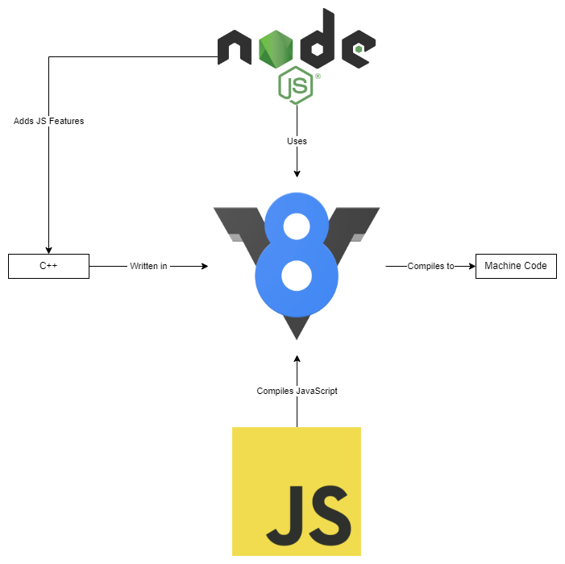
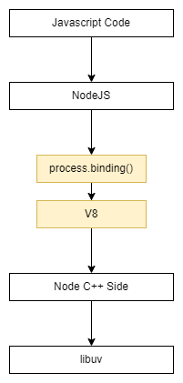

# Grafana overview <!-- omit in toc -->

## Contents <!-- omit in toc -->

- [1. Introduction](#1-introduction)
  - [1.1. Architecture](#11-architecture)

# 1. Introduction

- NodeJS is a different version of javascript.
- It allows you to run javascript code on the server, in theory not just on the server but on any machine though.
- NodeJS to run javascript outside of the browser.
  - NodeJS uses V8 and V8 simply is the name of the javascript engine built by Google that runs javascript in the browser.

## 1.1. Architecture

